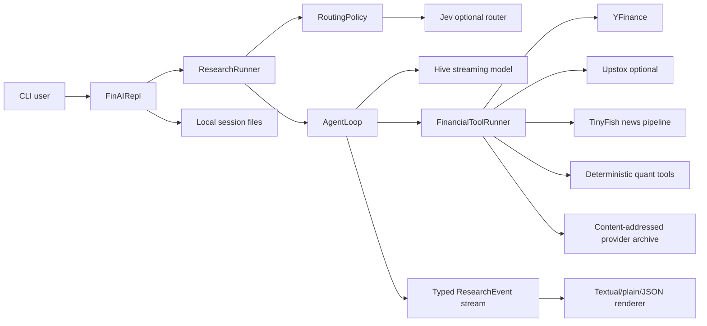

# FIN-AI

FIN-AI is a CLI-first research assistant for NSE/BSE equities. It combines live market and news providers with deterministic Python calculations and a bounded LLM/tool loop. It produces inspectable research artifacts; it does not place orders or provide personalised investment advice.

## What it does

A research request can resolve an instrument, fetch market/fundamental/news evidence, run deterministic fundamental or technical analysis, and synthesize a cited answer or structured report. Direct lookups such as price, market status, and holidays can bypass model generation. Ambiguous instruments are paused for clarification rather than guessed.

The runtime has two separate surfaces:

- **CLI:** the supported research interface, with Textual, plain, and JSON output modes.
- **FastAPI:** a small HTTP application currently exposing only `/` and `/api/health`; it is not an HTTP research API or SSE gateway.

The repository also contains an independent offline experiment package under [`backend/experiments/`](backend/experiments/) and an evaluation harness under [`evals/`](evals/). Neither changes the CLI research path.

## Architecture at a glance



The detailed call flow, state ownership, persistence layout, and failure behavior are in [`docs/architecture.md`](docs/architecture.md). Configuration is in [`docs/configuration.md`](docs/configuration.md), and tracing is in [`docs/observability.md`](docs/observability.md).

## Technology

- Python 3.11-3.14, managed with `uv`
- FastAPI and Uvicorn for the health application
- Textual and Rich for the terminal UI
- HTTPX for provider calls
- Pydantic v2 and `pydantic-settings` for schemas and configuration
- NumPy, Pandas, TA-Lib, and pandas-ta-classic for deterministic analysis
- YFinance, optional Upstox, and TinyFish
- Optional OpenTelemetry/Phoenix tracing

There is no Dockerfile, deployment manifest, PostgreSQL, Redis, vector database, embedding service, scheduled worker, or local inference server in this repository.

## Repository layout

| Path | Responsibility |
| --- | --- |
| `backend/finai/` | CLI, Textual UI, rendering, sessions, local persistence |
| `backend/app/core/agent_loop/` | Bounded model/tool orchestration and publication validation |
| `backend/app/services/` | Hive, Jev, and optional ChatGPT Codex provider clients |
| `backend/data/` | YFinance/Upstox adapters and the news search/extraction pipeline |
| `backend/quant/` | Deterministic fundamental and technical calculations |
| `backend/experiments/` | Separate offline feature, signal, simulation, and validation runtime |
| `backend/skills/` | Reviewed skill packages selected from query terms |
| `evals/` | Synthetic, replay, live benchmark, adversarial, and judge tooling |
| `backend/tests/` | Unit and integration regression tests |
| `docs/` | System, configuration, operations, and evaluation documentation |

## Setup

```bash
uv sync
cp .env.example .env
```

Set the provider keys needed for the workflow:

- `HIVE_API_KEY` for model generation
- `OPENROUTER_API_KEY` for Jev routing when `FINAI_ROUTER_ENABLED=true`
- `TINYFISH_API_KEY` for live news search
- `UPSTOX_ACCESS_TOKEN` is optional and enables Upstox instrument, market, and fundamentals paths

Configuration is loaded from the repository `.env` and then `.env`; unknown variables are ignored. See [`docs/configuration.md`](docs/configuration.md) for the complete variable inventory and operational defaults.

## Run the CLI

From the repository root:

```bash
PYTHONPATH=backend uv run python -m finai --help
PYTHONPATH=backend uv run python -m finai --plain "Analyze RELIANCE.NS"
PYTHONPATH=backend uv run python -m finai --json "What is the latest price of RELIANCE.NS?"
```

Without a query, the CLI starts Textual when attached to a TTY and a line-oriented terminal otherwise. Useful options include `--session`, `--data-dir`, `--mode guided|review|autonomous`, `--debug`, and `--replay-snapshots`. The `--plain` flag is accepted for compatibility; one-shot output is plain unless `--json` is selected.

Replay uses a JSON mapping of provider operations to hashes stored under the selected data directory. It disables live providers and is intended for deterministic local runs.

## Run the HTTP health application

```bash
PYTHONPATH=backend uv run uvicorn app.main:app --reload
```

Available application routes are:

- `GET /` - welcome payload and `/docs` link
- `GET /api/health` - provider-key/readiness checks, an internal canary, and an optional TinyFish live canary
- `/docs` and `/openapi.json` - FastAPI-generated documentation

`/api/health` is unauthenticated. Its TinyFish canary can make a paid external request, and TinyFish degradation does not make the core status unhealthy. Do not treat this endpoint as a production readiness contract.

## Verification

```bash
uv run ruff check backend evals
uv run mypy backend
uv run python -m compileall -q backend evals
PYTHONPATH=. uv run python -m evals.validate
PYTHONPATH=backend:. uv run python -m evals.adversarial
uv run pytest backend/tests --no-cov
uv run pytest backend/tests --cov=backend --cov-report=term-missing --cov-fail-under=70
```

CI runs on pushes and pull requests with Ruff, mypy, evaluation manifest checks, selected evaluation tests, the backend suite, and the 70% coverage threshold. See [`docs/development.md`](docs/development.md).

## Evaluation

Evaluation evidence is separated into synthetic contract checks, replay/live operational runs, deterministic provider checks, semantic judging, and offline experiments. No complete trustworthy financial-answer accuracy or investment-performance result was found. See [`docs/evaluation.md`](docs/evaluation.md) for recorded metrics, commands, and limitations.

## Security and limitations

Credentials and local research artifacts require operator protection. Full traces can contain prompts, evidence, and model responses; the HTTP surface is unauthenticated; and providers can be incomplete, stale, rate-limited, or unavailable. Company-name resolution may require clarification, and there is no order-execution path. See [`docs/architecture.md`](docs/architecture.md), [`docs/observability.md`](docs/observability.md), and [`docs/infrastructure.md`](docs/infrastructure.md) for the implemented boundaries and gaps.

## Documentation index

### System and operations

| Document | Contents |
| --- | --- |
| [`docs/architecture.md`](docs/architecture.md) | Runtime components, request/data flow, events, state, persistence, retries, and failure behavior |
| [`docs/ml-system.md`](docs/ml-system.md) | Prompts, skills, providers, tools, evidence, deterministic quant boundaries, and AI failure modes |
| [`docs/configuration.md`](docs/configuration.md) | Environment variables, provider selection, limits, and sensitive settings |
| [`docs/observability.md`](docs/observability.md) | Event ledgers, provider archives, replay, Phoenix, traces, metrics, and retention |
| [`docs/infrastructure.md`](docs/infrastructure.md) | CI, local topology, persistence, scaling implications, and absent deployment assets |
| [`docs/development.md`](docs/development.md) | Setup, commands, tests, replay, CI equivalence, and change boundaries |
| [`docs/prompt-management.md`](docs/prompt-management.md) | YAML prompt registry format and validation |
| [`docs/model-call-tracing.md`](docs/model-call-tracing.md) | Raw local model-call trace setup and format |

### Evaluation

| Document | Contents |
| --- | --- |
| [`docs/evaluation.md`](docs/evaluation.md) | Authoritative evaluation taxonomy, recorded results, metrics, provenance limits, and gaps |
| [`docs/evaluation-live-gpt-benchmark.md`](docs/evaluation-live-gpt-benchmark.md) | Upstox collection, replayable GPT pilot/full-run procedure, and retry workflow |
| [`docs/adversarial-evaluation.md`](docs/adversarial-evaluation.md) | Offline manifest validation and explicitly opt-in live adversarial checks |

### Repository workflow

These documents describe maintainer and agent workflow, not application runtime behavior:

- [`AGENTS.md`](AGENTS.md) - repository engineering and compliance guidance
- [`docs/agents/issue-tracker.md`](docs/agents/issue-tracker.md) - GitHub issue operations and canonical triage labels

### Module-local documentation

- [`backend/data/README.md`](backend/data/README.md) - provider and data-pipeline boundary
- [`backend/finai/styles/README.md`](backend/finai/styles/README.md) - Textual style organization and safe edits
- [`backend/skills/`](backend/skills/) - runtime skill package manifests and prompts
- [`evals/candidates/pilot-v1/README.md`](evals/candidates/pilot-v1/README.md) - candidate evaluation-set promotion rules
