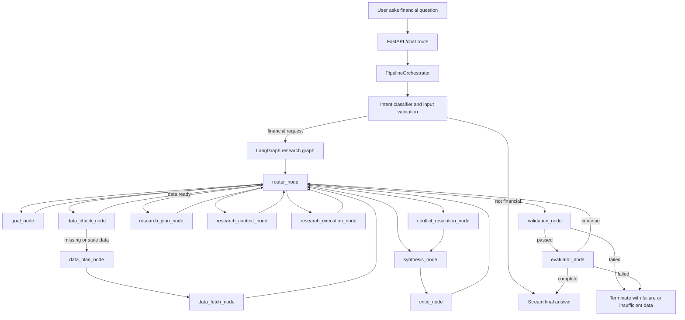
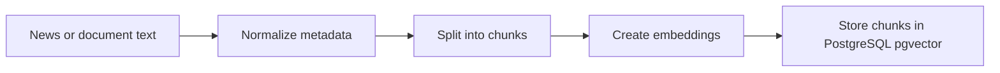
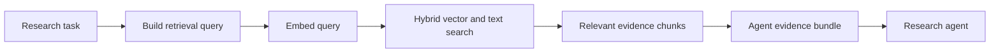

# FIN-AI: Financial Intelligence Platform

FIN-AI is a backend-first financial research system. It takes a user question like "Give me a detailed analysis of Reliance" and turns it into a structured research workflow.

The system does not let the LLM guess numbers. Market data, ratios, indicators, freshness checks, and validation rules are handled by deterministic Python code. The LLM is used for language understanding, planning, and synthesis only after the system has collected evidence.

In simple terms: FIN-AI is a research assistant that first gathers data, checks the data, retrieves supporting context, runs specialized agents, verifies claims, and then produces an explainable answer.

---

## What This Project Does

FIN-AI helps answer financial research questions by combining:

- Structured market data such as OHLCV prices, fundamentals, and macro data.
- Unstructured text such as news articles, filings, and other research context.
- Deterministic quant logic written in Python.
- A LangGraph-based agent workflow that decides what to do next.
- A RAG system that retrieves relevant text evidence from `pgvector`.
- Quality gates that check whether the final answer is supported by evidence.

Example user question:

```text
Analyze TCS for the next 6 months. Include technicals, fundamentals, risks, and recent news.
```

Expected backend behavior:

- Validate the query.
- Detect that this is a financial research request.
- Extract the goal, ticker, timeframe, and required research dimensions.
- Check whether local data is available and fresh.
- Fetch missing or stale data.
- Build research tasks for specialized agents.
- Retrieve relevant news/context through RAG.
- Run research agents against verified inputs.
- Synthesize claims and risks.
- Validate the final result before returning it.

---

## Main Repository Structure

```text
backend/
  app/
    routes/                 FastAPI routes, including /api/chat
    core/                   Orchestrator, graph runtime, validation, prompts, observability
    services/               LLM, embedding, MCP, and support services
    config/                 Settings and environment-driven configuration

  agents/
    orchestration/          Router, goal extraction, validation nodes
    financial/data/         Data check, data plan, data fetch, status, evidence helpers
    financial/research/     Research planning, context assembly, execution
    quality/                Synthesis, critic, evaluator, conflict resolution

  data/
    providers/              External data providers such as YFinance
    interfaces/             Storage/fetcher contracts
    processors/             Text processing and normalization
    schemas/                Market and text schemas
    news_pipeline/          News search, extraction, quality scoring, normalization

  storage/
    sql/                    PostgreSQL storage and SQLModel models
    vector/                 pgvector-backed RAG storage

  quant/                    Deterministic technical, fundamental, macro, and risk logic

frontend/                   Next.js frontend
ai_engineering/             Project constitution and coding standards
graphify-out/               Generated architecture graph/report
```

---

## Core Rule: LLMs Do Not Calculate

This project has a strict separation between computation and reasoning.

The LLM may:

- Understand what the user is asking.
- Help plan which research tasks are needed.
- Summarize evidence into readable text.
- Explain risks and tradeoffs.

The LLM must not:

- Calculate financial ratios.
- Compute technical indicators.
- Forecast time-series values.
- Invent numbers.
- Treat unverified text as truth.

All numerical work belongs in Python modules under `backend/`, especially `backend/quant/`, `backend/data/`, and `backend/storage/`.

Example:

```text
Bad:  LLM says "RSI is around 65" because it sounds reasonable.
Good: Python calculates RSI from OHLCV data, then the LLM explains what that RSI means.
```

---

## Backend Entry Point

The main user-facing backend path starts at the chat route:

```text
backend/app/routes/chat.py
```

The `/chat` endpoint receives messages from the frontend and streams events back using Server-Sent Events.

High-level flow:

1. The frontend sends a chat request.
2. The backend extracts the latest user message.
3. The request is passed to `PipelineOrchestrator`.
4. The orchestrator runs the LangGraph research pipeline.
5. The backend streams status updates, text deltas, errors, and completion events back to the client.

Important file:

```text
backend/app/core/orchestrator.py
```

Important class:

```text
PipelineOrchestrator
```

The orchestrator is the central coordinator. It does not do every task itself. Instead, it validates input, classifies intent, builds the initial graph state, runs the graph, and streams results.

---

## The Full Backend AI-Agent Graph

The backend research workflow is built with LangGraph in:

```text
backend/app/core/graph/runtime/graph_builder.py
```

The graph is a state machine. Each node receives the current research state, adds or updates information, and returns the next state. The router decides which node should run next.



---

## What Each Agent Node Does

### `router_node`

The router is the traffic controller. It looks at the current graph state and decides the next step.

Example decisions:

- Run goal extraction.
- Check data availability.
- Fetch missing data.
- Build research tasks.
- Run synthesis.
- Stop because the answer is complete.

The router keeps the pipeline from being a fixed script. The system can loop when more work is needed.

### `goal_node`

The goal node converts the user request into a structured goal.

Example input:

```text
Give me a long-term investment thesis for HDFC Bank.
```

Example extracted goal:

```json
{
  "ticker": "HDFCBANK",
  "timeframe": "long_term",
  "task": "investment_thesis",
  "required_dimensions": ["fundamentals", "risk", "news", "valuation"]
}
```

### `data_check_node`

The data check node asks: "Do we already have enough local data to answer this?"

It checks dataset availability and freshness. If data is missing or stale, the graph moves to data planning and fetching.

Example:

```text
OHLCV: available and fresh
fundamentals: available but stale
news: missing
```

Result: the system must fetch fundamentals and news before analysis.

### `data_plan_node`

The data plan node creates a concrete fetch plan.

It decides which datasets should be fetched, for which symbols, and for what timeframe.

Example plan:

```json
[
  {"dataset": "fundamentals", "ticker": "TCS"},
  {"dataset": "news", "ticker": "TCS", "lookback_days": 30},
  {"dataset": "ohlcv", "ticker": "TCS", "period": "1y"}
]
```

### `data_fetch_node`

The data fetch node executes the fetch plan.

It can call market data providers, news pipelines, persistence helpers, and vector storage indexing. It normalizes data before storing it.

Common outputs:

- Structured OHLCV data.
- Fundamentals.
- News articles.
- Data status summaries.
- Evidence IDs and cache metadata.

### `research_plan_node`

The research plan node breaks the goal into specific research tasks.

Example:

```text
User asks for a complete stock analysis.
```

The node may create tasks such as:

- Technical analysis.
- Fundamental analysis.
- Sentiment/news analysis.
- Risk analysis.
- Contrarian analysis.

Each task defines what data and evidence it needs.

### `research_context_node`

This is where RAG becomes important.

The research context node prepares the input for each research task. It collects:

- Structured data from the fetch stage.
- Qualitative evidence from vector search.
- Dataset coverage status.
- Retrieval diagnostics.

It uses `build_execution_input()` from:

```text
backend/agents/financial/research/context_assembly.py
```

If vector search finds relevant chunks, those chunks become evidence. If vector search is empty but fetched news exists, the system can use fetched news as a fallback.

### `research_execution_node`

The research execution node runs the planned research tasks using the prepared evidence bundles.

It does not start from a blank prompt. It receives structured inputs and retrieved evidence so the agent can produce grounded claims.

Example output from a research task:

```json
{
  "claims": [
    {
      "claim_id": "technical-1",
      "text": "The stock is trading above its medium-term moving average.",
      "evidence_ids": ["ohlcv:TCS:2026-05-20"],
      "importance": "major"
    }
  ],
  "risks": ["Recent news sentiment is mixed"]
}
```

### `synthesis_node`

The synthesis node combines outputs from multiple research agents.

It produces a single decision-style summary from the available claims, risks, and evidence strength.

Important rule: synthesis should use verified claims and evidence-backed outputs. It should not invent unsupported conclusions.

### `critic_node`

The critic node reviews the claims and looks for problems.

Examples:

- Claim has no evidence.
- Claim contradicts another agent.
- Claim is too strong for the available data.
- A risk is missing.

### `conflict_resolution_node`

If different agents disagree, this node helps resolve or mark the conflict.

Example:

```text
Technical analysis is positive, but news/risk analysis is negative.
```

The system should not hide that conflict. It should either resolve it with evidence or show the user the uncertainty.

### `validation_node`

The validation node is a final safety and correctness gate.

It checks whether the answer is acceptable before moving forward.

It can fail closed if required information is missing or confidence is too low.

### `evaluator_node`

The evaluator node decides whether the pipeline can finish or needs another loop.

Example:

```text
If synthesis is weak because news evidence is missing, go back and fetch/retrieve more context.
If validation passes and confidence is enough, finish.
```

---

## How RAG Works In This Project

RAG means Retrieval-Augmented Generation.

In easy terms: before the system asks an LLM to explain something, it first searches a knowledge base for relevant evidence. The LLM then writes using that evidence instead of relying only on memory.

In FIN-AI, RAG is used mainly for qualitative evidence such as news, filings, and contextual text.

### RAG Storage

The vector storage implementation is:

```text
backend/storage/vector/pgvector_storage.py
```

It uses PostgreSQL with `pgvector` to store text chunks and embeddings.

Each text chunk contains:

- A chunk ID.
- Ticker symbol.
- Text content.
- Metadata such as source, URL, date, source type.
- Embedding vector.

### RAG Indexing Flow



When news or text is fetched, the system can chunk the text, embed it, and upsert it into the vector database.

### RAG Retrieval Flow



The retrieval logic uses:

- Vector similarity search.
- Text search.
- Ticker filtering.
- Optional recency windows.
- Reciprocal rank fusion style scoring.

This means the system can search for text that is semantically similar to the research question while also respecting ticker and freshness constraints.

Example:

```text
Research task: "Find recent risks for TCS related to revenue growth."
```

The system embeds that query, searches the vector database for recent TCS-related chunks, and returns matching evidence such as news summaries or extracted article text.

---

## Structured Data vs RAG Data

The backend uses two broad types of data.

### Structured Data

Structured data is numeric or schema-based.

Examples:

- OHLCV price candles.
- Fundamentals.
- Ratios.
- Technical indicators.
- Data freshness status.

This data is handled deterministically.

Example:

```text
RSI, MACD, and Bollinger Bands are calculated by Python code, not by the LLM.
```

### RAG Data

RAG data is text evidence.

Examples:

- News articles.
- Filing excerpts.
- Research snippets.
- Extracted web content.

This data helps the LLM explain context, risks, and qualitative developments.

Example:

```text
The LLM may explain that recent margin pressure is a risk, but only if retrieved news or structured data supports that claim.
```

---

## Data Layer

The data layer follows a simple rule:

```text
Fetch -> Validate -> Normalize -> Store -> Retrieve
```

Important components:

- `backend/data/providers/yfinance.py` fetches market data.
- `backend/data/news_pipeline/` handles news search, extraction, quality, and normalization.
- `backend/data/schemas/` defines market and text data shapes.
- `backend/storage/sql/` stores structured records in PostgreSQL.
- `backend/storage/vector/` stores text chunks for RAG search.

The system avoids mixing raw data ingestion with LLM reasoning. Raw data pipelines should not contain sentiment synthesis or investment conclusions.

---

## Resource Container

Nodes access shared services through:

```text
backend/app/core/node_resources.py
```

This provides lazy access to:

- `llm_service`: local LLM through llama.cpp service integration.
- `sql_db`: PostgreSQL client.
- `vector_db`: pgvector storage.
- `yf_fetcher`: YFinance data fetcher.

Lazy access means the resource is created only when needed.

---

## Observability And Audit Trail

The backend records what happens inside the pipeline.

Important ideas:

- Each node returns structured output.
- Nodes attach audit data.
- The orchestrator streams status events.
- Opik tracing is used for observability spans.
- Session logging captures useful execution snapshots.

This is important because financial research must be explainable. A final answer should not be a black box.

Example audit questions the system should help answer:

- Which node ran?
- What data was missing?
- Which datasets were used?
- Which evidence chunks were retrieved?
- Why did validation pass or fail?

---

## End-To-End Example

User asks:

```text
Should I watch Reliance for a medium-term opportunity? Include news and risks.
```

Step-by-step backend behavior:

1. `/chat` receives the request.
2. `PipelineOrchestrator` sanitizes the query.
3. Intent classifier confirms it is a financial request.
4. LangGraph starts at `router_node`.
5. `goal_node` extracts ticker, timeframe, and requested dimensions.
6. `data_check_node` checks local OHLCV, fundamentals, and news availability.
7. If data is stale, `data_plan_node` creates a fetch plan.
8. `data_fetch_node` fetches and stores missing data.
9. `research_plan_node` creates tasks for technical, news, risk, and synthesis work.
10. `research_context_node` retrieves relevant news chunks from pgvector.
11. `research_execution_node` runs research tasks using structured data and retrieved evidence.
12. `synthesis_node` combines claims into a coherent view.
13. `critic_node` checks claim quality and evidence links.
14. `validation_node` checks whether the answer is safe and grounded.
15. `evaluator_node` decides whether to finish or loop back for more work.
16. The final response is streamed to the frontend.

The important point: the answer is not produced in one LLM call. It is built through a controlled pipeline.

---

## Running The Backend

This project uses the `fin` conda environment locally.

Example test command:

```bash
/home/zeek/miniconda3/bin/conda run -n fin env PYTHONPATH=backend pytest backend/tests
```

Example lint command:

```bash
/home/zeek/miniconda3/bin/conda run -n fin ruff check backend/ --exclude backend/llama.cpp
```

Start infrastructure:

```bash
docker compose -f backend/docker-compose.yml up -d
```

Start backend during development:

```bash
PYTHONPATH=backend uvicorn app.main:app --reload --port 8000
```

Start frontend:

```bash
cd frontend
npm install
npm run dev
```

---

## Development Principles

- Keep quantitative work deterministic and in Python.
- Keep agents focused on one responsibility.
- Do not add LLM logic to raw data ingestion.
- Ground every investment thesis in verified data.
- Prefer small, testable modules over large mixed-responsibility files.
- Validate and normalize data before storage.
- Treat missing data as a first-class state, not as something to hide.

---

## Mental Model

Think of FIN-AI as a financial research team inside software:

- The router is the project manager.
- The goal node reads the assignment.
- The data nodes gather and verify the raw materials.
- The RAG system finds relevant written evidence.
- Research agents analyze specific parts of the question.
- The synthesis node writes the combined view.
- The critic and validator check whether the answer is trustworthy.
- The evaluator decides whether the work is complete.

That is the main idea of the backend AI-agent RAG system.
