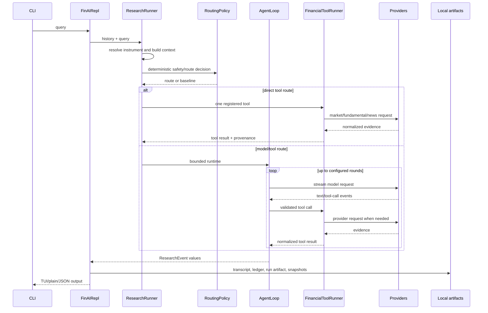
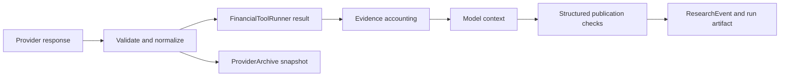

# Architecture

## Scope

FIN-AI is a local, CLI-first research application. The CLI constructs the research runtime. FastAPI currently provides a root response and a health route only; it does not construct `ResearchRunner`, expose research requests, or stream research events over HTTP.

## Components

| Component | Code | Responsibility |
| --- | --- | --- |
| CLI | `backend/finai/cli.py` | Parses options, chooses TUI/plain/JSON execution, and owns provider shutdown |
| Session facade | `backend/finai/session.py` | Loads history, appends messages, streams events, and persists runs |
| Research runner | `backend/finai/session_runtime.py:ResearchRunner` | Resolves instruments, builds router context, selects routes/providers, and constructs one `AgentLoop` |
| Router | `backend/app/services/routing_policy.py:RoutingPolicy` | Applies safety and deterministic routes, then optionally asks Jev for a typed route |
| Agent loop | `backend/app/core/agent_loop/runtime.py:AgentLoop` | Runs bounded model/tool rounds, accounts for evidence, validates publication, and emits typed events |
| Tool boundary | `backend/app/core/agent_loop/tool_runner.py:FinancialToolRunner` | Exposes the registered data and analysis tools and joins provider data to deterministic analysis |
| Providers | `backend/app/services/`, `backend/data/providers/`, `backend/data/news_pipeline/` | Model generation, routing, market data, fundamentals, and news retrieval |
| Persistence | `backend/finai/session_store.py`, `backend/app/observability/provider_archive.py` | Stores transcripts, events, run artifacts, checkpoints, and content-addressed provider snapshots |
| Presentation | `backend/finai/app.py`, `backend/finai/plain.py` | Reduces `ResearchEvent` values into TUI, plain text, or JSON output |

## Request lifecycle



### Instrument resolution

`ResearchRunner._resolve_instrument_context()` first accepts an explicit canonical ticker, then optionally searches Upstox for company-like references, then reuses a ticker from conversation context. Ambiguous or unresolved instrument references are turned into a clarification route. The system does not silently choose a company from an ambiguous name.

### Routing

`RoutingPolicy` rejects high-risk input through `assess_input_safety()`. It deterministically routes price, market-status, and holiday queries when the matching tool exists. Other queries go to Jev when enabled. Jev returns a typed `RoutePlan`; missing credentials, low confidence, invalid responses, and provider failures fall back to the bounded baseline route.

### Agent loop limits

`AgentLoopConfig` supplies the safety and resource ceilings:

- 12 model rounds by default
- 300 seconds for one run
- 128 emergency tool calls
- 32,000 estimated input tokens
- one permitted duplicate tool-result reuse by default
- report repair and publication validation limits from settings

Tool arguments are validated by `ToolExecutor`. Known provider and value failures are converted to unsuccessful tool results, allowing the loop to produce an evidence-limited outcome instead of exposing an uncontrolled exception. Cancellation, clarification, denial, provider failure, and partial evidence have distinct terminal events.

## Registered tools

`FinancialToolRunner.definitions()` publishes these tools:

- `data:fetch_stock_data`
- `data:fetch_fundamentals`
- `news:fetch_news`
- `analysis:run_fundamental_scan`
- `analysis:run_technical_scan`
- `analysis:get_technical_overview`
- `interaction:ask_user`
- `data:fetch_market_status`
- `data:fetch_market_holidays`

The tool schema restricts ticker length and characters, periods, intervals, limits, exchanges, and dates. Tools return provenance where the provider supplies it. The report publication path checks evidence references and falls back when a structured report cannot be supported.

## Data lifecycle



- **YFinance:** formats Indian tickers, normalizes OHLCV and fundamentals, validates market records/freshness for price data, and attaches provenance.
- **Upstox:** is optional, uses a local SQLite request quota, resolves NSE instruments, fetches candles/fundamentals/news and market context, and falls back to YFinance for supported paths when an Upstox request fails.
- **News:** `NewsPipelineRunner` runs TinyFish and optional Upstox connectors concurrently, extracts article text, normalizes URLs, deduplicates, checks company relevance, scores quality, and can retain degraded candidates when no item meets the threshold.
- **Quant:** `FundamentalScanner` and `TechnicalEngine` calculate deterministic values behind the tool boundary. The LLM receives their outputs; it is not the calculation layer.

## State and persistence

`SessionStore` owns filesystem state under the selected data directory:

```text
<data-dir>/
  sessions/<session>/
    transcript.jsonl
    events.jsonl
    events.v1.jsonl
    context.json
    pending.json
    checkpoint.json
    runs/<run-id>.json
    artifacts/<sha256>.json
  provider-snapshots/<prefix>/<sha256>.json
```

The exact event ledger is appended before the next operation. Response deltas are treated as non-durable in the trace ledger; semantic events are durable. Run files include query, terminal status, event list, and a feedback summary. Interrupted `running` files are marked interrupted on the next session load. Checkpoints contain the model/tool boundary needed to resume clarification or an incomplete tool path.

Provider snapshots are immutable JSON records keyed by a SHA-256 hash. Replay loads only the referenced snapshots and rejects missing or mismatched hashes. `RunManifest` is available as a reusable manifest model, but the normal CLI path writes `SessionStore` run files rather than a manifest for every run.

## Concurrency, retries, and recovery

- The CLI runs one active research stream per session.
- News connectors run concurrently; extraction is capped by a semaphore of five and moved to a one-worker thread executor so synchronous parsing does not block the event loop.
- Hive streams use connect/pool/write/read timeouts, a whole-request budget, bounded retries for selected HTTP statuses, backoff, and a circuit breaker.
- Jev uses a ten-second request timeout and a bounded retry policy.
- ChatGPT Codex uses the local OAuth credential and falls back to Hive when the request fails before streaming starts; it does not retry Codex requests.
- Upstox uses request quotas and response validation but has no provider retry policy in its adapter.
- Phoenix and tracing are best effort. Tracing setup failure does not stop a run.

There is no queue, distributed lock, worker pool for research runs, external cache, or multi-instance coordination layer. The filesystem model is therefore local-oriented and requires additional locking, shared storage, retention, and backup design before multi-process deployment.

## HTTP boundary

`backend/app/main.py` registers:

- `GET /`
- `GET /api/health`

The global exception handler returns a generic 500 payload with a generated request reference. `/api/health` checks API-key presence for Hive, import readiness for YFinance, a local normalization canary, and an optional live TinyFish canary. It is not an authenticated or comprehensive dependency probe.

## Security boundary

Secrets are loaded from environment variables or the local ChatGPT credential file. Trace helpers redact common credential fields. Local artifacts are not encrypted or centrally access-controlled, and full model traces may contain sensitive prompts, evidence, and responses. There is no user authentication or authorization in the HTTP surface and no trading/order tool.
