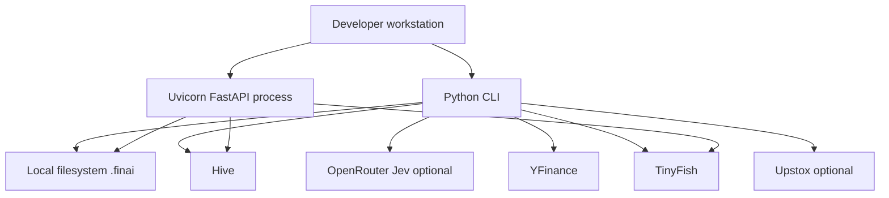

# Infrastructure and deployment

## What exists

The committed operational infrastructure is a Python dependency lockfile and one GitHub Actions workflow. `pyproject.toml` uses `uv`, sets `package = false`, and supports Python 3.11 through 3.14. CI runs on Ubuntu with Python 3.11 and installs from the frozen lockfile.

`.github/workflows/ci.yml` runs on branch pushes and pull requests:

1. Ruff lint for `backend/` and `evals/`
2. mypy for `backend/`
3. evaluation and adversarial manifest integrity checks
4. selected evaluation-support tests
5. CLI and offline-experiment smoke checks
6. the backend test suite
7. a 70% coverage threshold
8. a docs-sanity grep for removed script names

CI does not build an image, deploy a service, upload artifacts, run a migration, scan dependencies, or provision infrastructure.

## Local runtime topology



The CLI and API are separate process entry points. The API currently has health/root routes only. Normal research state is local filesystem state, not a service database.

## Persistence and scaling implications

The runtime writes session transcripts, event ledgers, run artifacts, checkpoints, provider snapshots, optional traces, and a local SQLite quota database. There is no shared database, object store, queue, distributed lock, backup job, retention controller, or multi-instance coordination. A production deployment would need explicit decisions for:

- shared or per-instance session storage
- concurrent writes and locking
- credential and secret management
- backups and restore
- artifact retention and deletion
- authentication, authorization, TLS, and rate limiting
- provider quota isolation
- metrics, alerting, and log shipping
- resource limits and worker lifecycle

These are deployment requirements, not implemented guarantees.

## Starting services

CLI:

```bash
PYTHONPATH=backend uv run python -m finai --plain "Analyze RELIANCE.NS"
```

Development API:

```bash
PYTHONPATH=backend uv run uvicorn app.main:app --reload
```

The API health endpoint is not a production readiness probe. It checks Hive key presence rather than making a Hive request, verifies that YFinance imports, runs a local canary, and may make a live TinyFish search. It is unauthenticated and exposes provider URL/status information.

## Absent deployment assets

No Dockerfile, Compose file, Kubernetes/Helm manifests, Terraform/Pulumi/CloudFormation, reverse proxy configuration, systemd unit, production Uvicorn/Gunicorn configuration, secret-manager integration, or autoscaling configuration was found. No rollback or disaster-recovery procedure is encoded in the repository.
